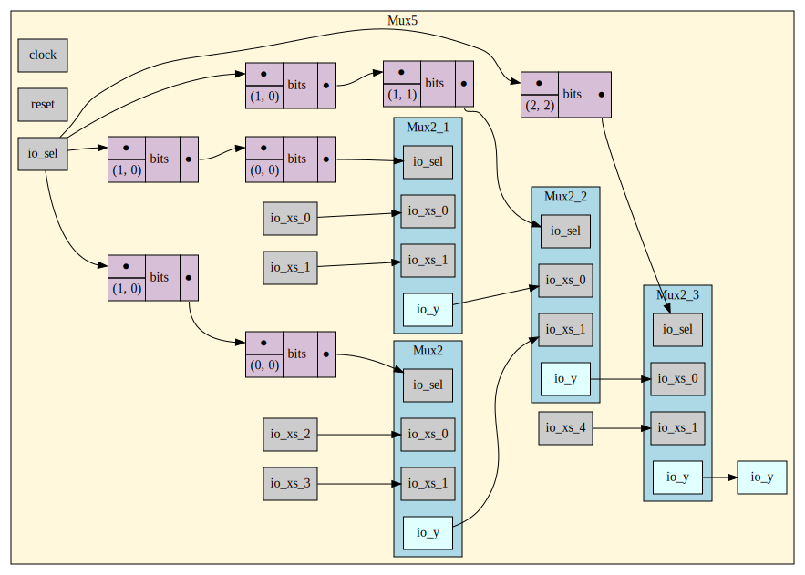
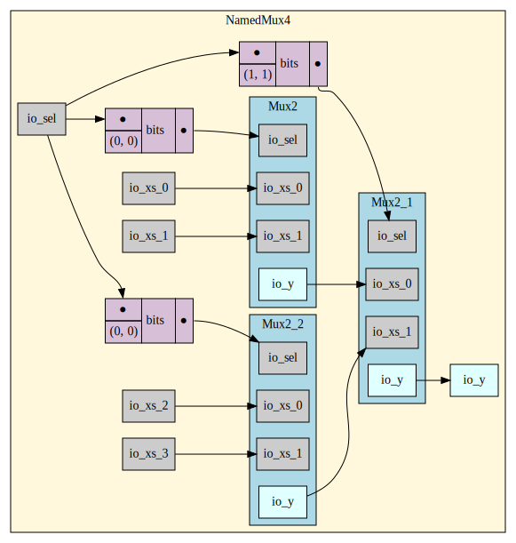
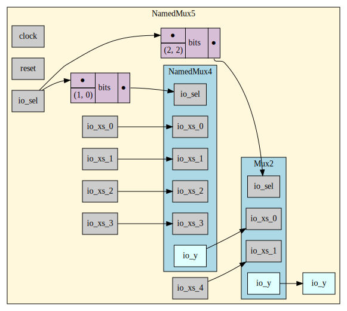

Toy Parallel Mux Generator
=======================

Given a `Mux2` module, this project offers a toy model as a parallel mux generator for any number of inputs. 

## Module Interface

With the number $n$ and type `T <: Data` of inputs, the generated mux has an `MuxIO` as the interface with the following components:

* `sel`: input, an `UInt` instance with its width `log2Up(n)`.
* `xs`: input, a `Vec[T]` instance with its length $n$.
* `y`: output, a `T` instance. Conceptually we should have `y == xs(sel)`.

Notice that the interface is not registered.

## Design Internals

For a given number $n$ of inputs where $n > 2$, let $n_{\text{low range}} = 2^{\lfloor \log_{2}(n) \rfloor}$ and $n_{\text{high range}} = n - n_{\text{low range}} \leq n_{\text{low range}}$. Notice that , the index of the selected input lies in $[0, n_{\text{low range}})$ if and only if the MSB of `sel` is `0`. This observation allows us to:

1. Divide the inputs into the first $n_{\text{low range}}$ inputs to an $n_{\text{low range}}$-mux and the last $n_{\text{high range}}$ inputs to an $n_{\text{high range}}$-mux. The `sel` of both smaller muxes are connected with the lower $\lfloor \log_{2}(n) \rfloor$ bits of `sel`. *(Though $n_{\text{high range}}$ is often smaller than $n_{\text{low range}}$ thus may only require a `sel` with smaller bit width, the bit width of the interface of the $n_{\text{high range}}$-mux deals with the truncation implicitly.)*
2. Select the from their outputs using a `Mux2` with the MSB of `sel`.

This bisection scheme is applied recursively until $n = 1$ or $n = 2$. When $n = 1$, a wire of the last input is directly used; when $n = 2$, a `Mux2` is instantiated.

Notice that the generated mux is combinational.

## Module Hierarchy

There are two styles of module hierarchy is provided:

* `MuxN[T <: Data](gen: T, n: Int)` generates a single module containing `Mux2`s and the wires. 
* `NamedMuxN[T <: Data, NNat <: Nat](gen: T, nat: NNat)` generates the desired module and all the involved $2^{m}$-muxes $(m \leq \lfloor\log_{2}(n)\rfloor)$.  

## Type Features

As an experimental toy project, a few features in type system are added to some software guy's concerns:

* Generic type: Both `MuxN` and `NamedMuxN` supports generic types of inputs.
* Type safety: Experimentally, `NamedMuxN` shows how to differ muxes with different numbers of inputs at type level. (Maybe an overkill.)

## Usage

### Emit Verilog

After modifying `src/main/scala/muxgen/main.scala` for your desired number and type of inputs, change your directory to the root directory of the project and run the following in the shell:

```bash
$ make build
```

Then the generated annotations, firrtl files and Verilog files should lie in `build/`.

## Run Unit Test

*Before running the test, modify the `Mux2` class in `src/main/scala/muxgen/Mux2.scala` such that the class should be derived from `Module`  with its inner logic rather than a `BlackBox`.*

Run the following in the shell:

```bash
$ make test
```

